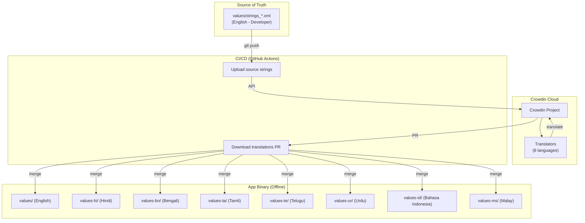
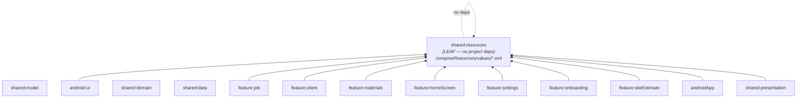

# Internationalization (i18n) — Master Plan (v2)

## Executive Summary

Karigo currently has **zero localization infrastructure**. Every single user-facing string across all 7 feature modules, shared UI components, shared models, and legal documents is hardcoded in English. This plan establishes an industry-grade, offline-first, Crowdin-powered internationalization system that works identically on Android and iOS through Compose Multiplatform's official resource system.

---

## Current State Audit

| Aspect | Finding |
|--------|---------|
| `strings.xml` files | 1 file, 1 string (`app_name`) |
| `stringResource()` calls | **Zero** |
| Localization libraries | **None** |
| Hardcoded UI strings | **~300+** across 7 feature modules |
| Hardcoded model strings | 18 TradeType (name+desc), 5 JobStatus |
| Legal content | **961 lines / 83 KB** of hardcoded English text in Kotlin |
| Bottom nav labels | 5 hardcoded in `AppRoutes.kt` |
| Content descriptions | 13+ hardcoded accessibility strings |
| KMP targets | Android + iOS (3 arch) |

---

## Technology Choice

### `compose.resources` (Official JetBrains) ✅

> [!IMPORTANT]
> We will use `compose.resources` — the official Compose Multiplatform resource system. It is stable since CMP 1.6.0, Karigo already runs CMP 1.11.1, and it requires no extra dependencies beyond the Compose Gradle plugin.

**Why not moko-resources?**
- moko is in maintenance mode; JetBrains officially recommends `compose.resources`
- moko requires an additional Gradle plugin and library dependencies
- `compose.resources` is built into the Compose plugin Karigo already uses

**How it works:**
```
src/commonMain/composeResources/
├── values/               ← Default (English)
│   ├── strings_common.xml
│   ├── strings_job.xml
│   ├── strings_legal.xml
│   └── ...
├── values-hi/            ← Hindi
│   ├── strings_common.xml
│   ├── strings_job.xml
│   ├── strings_legal.xml
│   └── ...
├── values-bn/            ← Bengali
│   └── ...
└── (8 language directories total)
```

Strings are accessed type-safely via a generated `Res` class:
```kotlin
// Simple
Text(stringResource(Res.string.settings_title))

// With arguments (positional)
Text(stringResource(Res.string.greeting, userName))

// Plurals
Text(pluralStringResource(Res.plurals.job_count, count, count))
```

---

## Architecture Overview



---

## Target Languages (8)

| Language | Code | Script | Direction | Notes |
|----------|------|--------|-----------|-------|
| English | `en` | Latin | LTR | Base language |
| Hindi | `hi` | Devanagari | LTR | Primary Indian market |
| Bengali | `bn` | Bengali | LTR | Eastern India market |
| Tamil | `ta` | Tamil | LTR | South India market |
| Telugu | `te` | Telugu | LTR | South India market |
| Urdu | `ur` | Nastaliq | **RTL** | Pakistan + Indian subcontinent |
| Bahasa Indonesia | `id` | Latin | LTR | Southeast Asian market |
| Malay | `ms` | Latin | LTR | Malaysian market |

> [!WARNING]
> **Urdu is RTL (right-to-left)**. This means we must audit all layouts to ensure `start`/`end` alignment is used everywhere instead of `left`/`right`. Your codebase already uses `start`/`end` in most places, but a full audit is needed.

---

## Strategic Module Placement

> [!IMPORTANT]
> **The `shared:resources` module must be a pure leaf-level module with ZERO code dependencies on any other project module.** This completely eliminates any possibility of circular dependency errors.

### Dependency Graph



**Why this is safe:**
- `shared:resources` contains **only** `composeResources/` XML files and thin Kotlin extension files (e.g., `TradeTypeResources.kt`)
- It depends only on the Compose Multiplatform plugin (for `Res` class generation) — **no `implementation(project(":shared:..."))` lines**
- Every other module depends **down** into it — no cycles possible
- If `TradeType` extension properties need the `TradeType` enum, we place them in the feature/UI layer that already depends on both `shared:model` and `shared:resources`

### Module Build File

```kotlin
// shared/resources/build.gradle.kts
plugins {
    alias(libs.plugins.kotlinMultiplatform)
    alias(libs.plugins.composeMultiplatform)
    alias(libs.plugins.composeCompiler)
}

kotlin {
    androidTarget()
    iosX64()
    iosArm64()
    iosSimulatorArm64()

    sourceSets {
        commonMain.dependencies {
            implementation(compose.runtime)
            implementation(compose.components.resources)
            // NO project dependencies — this is a leaf module
        }
    }
}
```

---

## String Key Naming Convention

We will use **hierarchical snake_case** naming organized by feature → screen → element:

```xml
<!-- Pattern: feature_screen_element_purpose -->

<!-- Common (shared across features) -->
<string name="common_btn_cancel">Cancel</string>
<string name="common_btn_save">Save</string>
<string name="common_btn_delete">Delete</string>
<string name="common_label_search">Search</string>

<!-- Bottom Navigation -->
<string name="nav_home">Home</string>
<string name="nav_jobs">Jobs</string>
<string name="nav_clients">Client</string>
<string name="nav_materials">Materials</string>
<string name="nav_settings">Settings</string>

<!-- Settings Feature -->
<string name="settings_title">Settings</string>
<string name="settings_section_legal">LEGAL &amp; INFO</string>
<string name="settings_item_about">About Karigo</string>

<!-- Trade Types -->
<string name="trade_plumber">Plumber</string>
<string name="trade_plumber_desc">Pipes, fittings, taps &amp; repairs</string>

<!-- Legal Content (long strings are fine in strings.xml) -->
<string name="legal_privacy_title">Privacy Policy</string>
<string name="legal_privacy_s01_title">Introduction &amp; Scope</string>
<string name="legal_privacy_s01_p1">Karigo (\"we\", \"our\", ...) is a mobile application...</string>
```

> [!TIP]
> Compose Resources merges all XML files in a `values/` directory into one flat namespace. Splitting by feature (`strings_common.xml`, `strings_job.xml`, `strings_legal.xml`) is purely for developer organization and Crowdin filtering.

---

## Proposed Changes

### Phase 0 — Infrastructure Setup

---

#### [NEW] `shared/resources/` module

A new KMP leaf module dedicated to holding all translatable resources.

**Directory structure:**
```
shared/resources/
├── build.gradle.kts
└── src/
    └── commonMain/
        └── composeResources/
            ├── values/
            │   ├── strings_common.xml      (~50 strings)
            │   ├── strings_nav.xml         (~5 strings)
            │   ├── strings_home.xml        (~20 strings)
            │   ├── strings_job.xml         (~60 strings)
            │   ├── strings_client.xml      (~30 strings)
            │   ├── strings_materials.xml   (~25 strings)
            │   ├── strings_onboarding.xml  (~30 strings)
            │   ├── strings_settings.xml    (~20 strings)
            │   ├── strings_about.xml       (~15 strings)
            │   ├── strings_estimate.xml    (~20 strings)
            │   ├── strings_trade.xml       (~36 strings)
            │   ├── strings_status.xml      (~5 strings)
            │   └── strings_legal.xml       (~200+ strings)
            ├── values-hi/
            │   └── (same file set — Hindi)
            ├── values-bn/
            │   └── (same file set — Bengali)
            ├── values-ta/
            │   └── (same file set — Tamil)
            ├── values-te/
            │   └── (same file set — Telugu)
            ├── values-ur/
            │   └── (same file set — Urdu)
            ├── values-id/
            │   └── (same file set — Bahasa Indonesia)
            └── values-ms/
                └── (same file set — Malay)
```

#### [MODIFY] [settings.gradle.kts](file:///Volumes/SSD/Coding/cmp/Projects/karigo/app/karigo/settings.gradle.kts)
- Add `include(":shared:resources")` to register the new module.

#### [MODIFY] Feature module `build.gradle.kts` files (all 7) + `android:ui` + `androidApp`
- Add `implementation(project(":shared:resources"))` to each module's dependencies.

---

### Phase 1 — String Extraction (Feature by Feature)

> [!IMPORTANT]
> Every hardcoded string in every Composable file is replaced with `stringResource(Res.string.key_name)`. We work **one feature module at a time** to keep changes reviewable.

---

#### Module 1: Common UI & Navigation (~55 strings)

##### [MODIFY] [CommonUi.kt](file:///Volumes/SSD/Coding/cmp/Projects/karigo/app/karigo/android/ui/src/main/kotlin/com/karigojobs/ui/common/CommonUi.kt)
- Extract: `"ACTION NEEDED"`, `"2 missing"`, `"Complete your business profile"`, `"Add Owner Name and Business Name..."`, and all other hardcoded labels in shared components.

##### [MODIFY] [AppRoutes.kt](file:///Volumes/SSD/Coding/cmp/Projects/karigo/app/karigo/androidApp/src/main/kotlin/com/karigojobs/app/navigation/AppRoutes.kt)
- Replace hardcoded bottom nav labels with `StringResource` references.

##### [MODIFY] [AppNavGraph.kt](file:///Volumes/SSD/Coding/cmp/Projects/karigo/app/karigo/androidApp/src/main/kotlin/com/karigojobs/app/navigation/AppNavGraph.kt)
- Replace `Text(text = screen.name)` with `Text(stringResource(screen.labelRes))`.

---

#### Module 2: Home Screen (~20 strings)

##### [MODIFY] HomeScreen.kt, HomeTopAppBar.kt, Component.kt
- Extract: `"Good Morning"`, `"Good Afternoon"`, `"Good Evening"`, `"Contractor"` (fallback), `"Recent Jobs"`, `"See all"`, `"Site Estimates"`, `"New Estimate"`, long descriptions.

---

#### Module 3: Job Feature (~60 strings)

##### [MODIFY] JobListScreen.kt, JobDetailsScreen.kt, AddJobScreen.kt, Component.kt
- Extract: `"All Jobs"`, `"JOB TITLE"`, `"SELECT TRADE"`, `"LABOUR"`, `"MATERIALS"`, `"CLIENT"`, `"Grand Total"`, `"Inc. labour & materials"`, `"Add Materials"`, `"Status"`, `"Change"`, all placeholders.

---

#### Module 4: Client Feature (~30 strings)

##### [MODIFY] ClientListScreen.kt, ClientDetailsScreen.kt, AddClientScreen.kt
- Extract: `"Clients"`, `"Job History"`, `"TOTAL JOBS"`, `"PENDING"`, `"PAID"`, `"UNPAID"`, `"New Job for %1$s"` (positional arg).

---

#### Module 5: Materials Feature (~25 strings)

##### [MODIFY] MaterialsListScreen.kt, AddMaterialScreen.kt, Component.kt
- Extract: `"Materials"`, `"MATERIAL NAME"`, `"TRADE"`, all placeholders like `"e.g. PVC Pipe 1/2 inch"`, `"ea, mtr, kg"`, `"Search Materials"`.

---

#### Module 6: Onboarding (~30 strings)

##### [MODIFY] WelcomeContent.kt, TradeSelectContent.kt, ProfileContent.kt
- Extract: `"Karigojobs"`, app description, feature slide titles/descriptions, all form placeholders.
- **Fix typo**: `"trcaking"` → `"tracking"` while extracting.
- Localize phone hint from `"+91 98765 43210"` to a generic format.

---

#### Module 7: Settings, About & Legal (~270 strings)

##### [MODIFY] [SettingsScreen.kt](file:///Volumes/SSD/Coding/cmp/Projects/karigo/app/karigo/feature/settings/src/main/kotlin/com/karigojobs/feature/settings/SettingsScreen.kt)
- Extract: `"LEGAL & INFO"`, tab names, quick access labels.

##### [MODIFY] [AboutScreen.kt](file:///Volumes/SSD/Coding/cmp/Projects/karigo/app/karigo/feature/settings/src/main/kotlin/com/karigojobs/feature/settings/AboutScreen.kt)
- Extract: `"About Karigo"`, `"Karigo"`, tagline, section headers, feature descriptions, footer text.

##### [MODIFY] [LegalPages.kt](file:///Volumes/SSD/Coding/cmp/Projects/karigo/app/karigo/feature/settings/src/main/kotlin/com/karigojobs/feature/settings/LegalPages.kt)
- **This is the biggest single extraction task** (~200+ strings).
- Every `LegalContentItem.Paragraph(...)`, `BulletList(...)`, `Callout(...)` text, section titles, and table cell texts will be extracted to `strings_legal.xml`.
- The Kotlin data structure stays (it defines the layout/ordering), but text content comes from string resources:
  ```kotlin
  // Before
  LegalContentItem.Paragraph("Karigo is provided on an \"as is\" basis...")

  // After
  LegalContentItem.Paragraph(stringResource(Res.string.legal_disclaimer_s01_p1))
  ```
- Section titles, badge text, callout text, contact block labels — all extracted.

##### [MODIFY] [LegalScreen.kt](file:///Volumes/SSD/Coding/cmp/Projects/karigo/app/karigo/feature/settings/src/main/kotlin/com/karigojobs/feature/settings/LegalScreen.kt)
- Extract: `"Document not found"`, contact info labels, footer format string.

---

#### Module 8: Site Estimate (~20 strings)

##### [MODIFY] AddEstimateScreen.kt, EstimateListScreen.kt
- Extract: all placeholders, section labels, action buttons.

---

### Phase 2 — Model Layer Refactoring

---

#### TradeType Display Names

**Current** (hardcoded English in `shared:model`):
```kotlin
enum class TradeType(
    val displayName: String,
    val description: String,
    ...
)
```

**Proposed** — Keep the enum as-is for DB/non-UI use. Add resource mapping as extension properties **in each feature module's UI layer** (since feature modules already depend on both `shared:model` and `shared:resources`):

```kotlin
// In any feature module that displays TradeType (e.g. feature:job, feature:settings)
// Or in android:ui if used across multiple features
@Composable
fun TradeType.localizedName(): String = stringResource(
    when (this) {
        TradeType.PLUMBER -> Res.string.trade_plumber
        TradeType.ELECTRICIAN -> Res.string.trade_electrician
        // ... all 18
    }
)

@Composable
fun TradeType.localizedDescription(): String = stringResource(
    when (this) {
        TradeType.PLUMBER -> Res.string.trade_plumber_desc
        // ... all 18
    }
)
```

**In Composables**, replace:
```kotlin
// Before
Text(trade.displayName)

// After
Text(trade.localizedName())
```

> [!NOTE]
> We keep the original `displayName` in the enum for non-UI usage (database storage, logging, analytics, CSV export). The `@Composable` extension is only used in UI contexts.

---

#### JobStatus Display Names

Same pattern — add `@Composable` localized extension for `"Pending"`, `"In Progress"`, `"Complete"`, `"Invoiced"`, `"Paid"`.

---

### Phase 3 — Language Selection UI

---

#### [NEW] Language Preference in DataStore

Add a `language_code` key to the existing DataStore preferences:
```kotlin
val LANGUAGE_KEY = stringPreferencesKey("selected_language")
```

#### [MODIFY] Settings Screen

Add a **Language** row in the settings screen (above the Legal section):
- Tapping opens a bottom sheet with available languages
- Each language shown in its **native script**:
    - `English`
    - `हिन्दी` (Hindi)
    - `বাংলা` (Bengali)
    - `தமிழ்` (Tamil)
    - `తెలుగు` (Telugu)
    - `اردو` (Urdu)
    - `Bahasa Indonesia`
    - `Bahasa Melayu` (Malay)
- Selection persists to DataStore and triggers locale change

#### [NEW] Locale Management (expect/actual)

Since Compose Multiplatform doesn't have a unified locale API:
```kotlin
// commonMain
expect fun setAppLocale(languageCode: String)
expect fun getAppLocale(): String

// androidMain
actual fun setAppLocale(languageCode: String) {
    AppCompatDelegate.setApplicationLocales(
        LocaleListCompat.forLanguageTags(languageCode)
    )
}

// iosMain
actual fun setAppLocale(languageCode: String) {
    // UserDefaults + Bundle.main.preferredLocalizations
}
```

---

### Phase 4 — Crowdin Setup & CI/CD

---

#### Crowdin Project Configuration

##### [NEW] `crowdin.yml` (project root)
```yaml
project_id_env: CROWDIN_PROJECT_ID
api_token_env: CROWDIN_API_TOKEN

files:
  - source: /shared/resources/src/commonMain/composeResources/values/strings_*.xml
    translation: /shared/resources/src/commonMain/composeResources/values-%two_letters_code%/%original_file_name%
```

##### [NEW] `.github/workflows/crowdin.yml`
```yaml
name: Crowdin Sync
on:
  push:
    branches: [main]
    paths:
      - 'shared/resources/src/commonMain/composeResources/values/strings_*.xml'

jobs:
  sync:
    runs-on: ubuntu-latest
    steps:
      - uses: actions/checkout@v4
      - uses: crowdin/github-action@v2
        with:
          upload_sources: true
          download_translations: true
          create_pull_request: true
          pull_request_title: 'chore(i18n): new translations from Crowdin'
          pull_request_labels: 'i18n, translations'
        env:
          CROWDIN_PROJECT_ID: ${{ secrets.CROWDIN_PROJECT_ID }}
          CROWDIN_PERSONAL_TOKEN: ${{ secrets.CROWDIN_API_TOKEN }}
```

**Workflow:**
1. Developer adds/edits English strings → pushes to `main`
2. GitHub Action uploads source strings to Crowdin
3. Translators work in Crowdin's web editor (supports context screenshots, glossaries, TM)
4. Crowdin auto-creates a PR with new translations
5. PR is reviewed & merged → translations ship with next app release

> [!TIP]
> Crowdin's **Translation Memory (TM)** will auto-suggest translations for similar strings, and the **Glossary** feature ensures consistency (e.g., "Job" is always translated the same way across all screens).

---

## RTL Considerations (Urdu)

Your codebase is already mostly RTL-safe because Compose uses `start`/`end`. However, verify:

- [x] `Modifier.padding(start = ...)` used instead of `left` ✅ (`contentHorizontalPadding()` is safe)
- [ ] Check any `Row` with hardcoded directional arrangement
- [ ] Icons with directional meaning (arrows) need `autoMirrored = true`
- [ ] Number formatting should use `NumberFormat.getInstance(locale)`
- [ ] Currency formatting should use locale-aware formatters (not hardcoded `₹`)
- [ ] Urdu uses Nastaliq script which renders taller — verify line heights don't clip

---

## Estimated String Count

| Category | Estimated Count |
|----------|----------------|
| Common (buttons, labels, errors) | ~50 |
| Navigation | ~5 |
| Home Screen | ~20 |
| Job Feature | ~60 |
| Client Feature | ~30 |
| Materials Feature | ~25 |
| Onboarding | ~30 |
| Settings & About | ~35 |
| Site Estimate | ~20 |
| Trade Types (name + desc) | ~36 |
| Job Statuses | ~5 |
| Content Descriptions (a11y) | ~15 |
| Legal Content (4 documents) | ~200+ |
| **Total Strings** | **~530+** |

Each string × 8 languages = **~4,200+ translated string entries** when fully complete.

---

## Execution Order & Phasing

| Phase | Scope | Effort | Blocks |
|-------|-------|--------|--------|
| **Phase 0** | Create `shared:resources` module, wire deps, verify build | Small | Nothing |
| **Phase 1a** | Extract common UI + navigation strings | Small | Phase 0 |
| **Phase 1b** | Extract Home + Job strings | Medium | Phase 0 |
| **Phase 1c** | Extract Client + Materials strings | Medium | Phase 0 |
| **Phase 1d** | Extract Onboarding + Settings + About strings | Medium | Phase 0 |
| **Phase 1e** | Extract Legal content strings (largest batch) | Large | Phase 0 |
| **Phase 1f** | Extract Site Estimate strings | Small | Phase 0 |
| **Phase 2** | Refactor TradeType + JobStatus with localized extensions | Small | Phase 0 |
| **Phase 3** | Language selection UI + locale management (expect/actual) | Medium | Phase 1 |
| **Phase 4** | Crowdin project + `crowdin.yml` + GitHub Actions | Small | Phase 1 |
| **Phase 5** | Translations (via Crowdin translators) | External | Phase 4 |
| **Phase 6** | RTL audit for Urdu | Small | Phase 1 |

> [!NOTE]
> Phase 1 sub-tasks (a–f) can run in parallel if multiple developers are available. Phase 5 is entirely external (translators working in Crowdin).

---

## Verification Plan

### Automated Tests
- `./gradlew compileDebugKotlin` after each phase
- Add a CI check that verifies all `values/` string keys exist in every `values-*/` directory (prevents shipping with missing translations)

### Manual Verification
- Switch language in Settings → verify every screen renders correctly
- Verify RTL layout mirroring with Urdu
- Verify Indic scripts render correctly (Hindi Devanagari, Bengali, Tamil, Telugu)
- Verify plurals work correctly (e.g., "1 job" vs "5 jobs")
- Verify text expansion doesn't break layouts (some translations can be 30-40% longer)

### Crowdin Verification
- Upload source strings → verify they appear in Crowdin dashboard
- Add test translation → verify PR is auto-created
- Merge PR → verify translated strings appear in the app

---

## Open Questions

> [!IMPORTANT]
> 1. **Legal translations**: Do you have access to professional translators for the legal documents, or should we use Crowdin's marketplace? Legal text should ideally be translated by humans with legal domain knowledge.
> 2. **Currency formatting**: Should the app dynamically format currencies based on locale (e.g., `₹500` vs `Rp 500` vs `RM 500`), or keep the user's manually set currency?
> 3. **Crowdin plan**: Free plan supports 1 project with unlimited languages. Do you need the Team plan for multiple collaborator seats?
